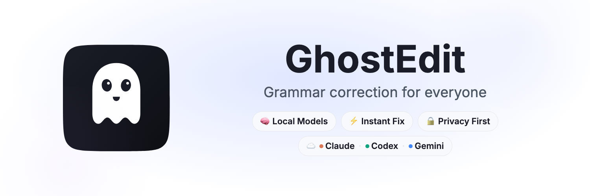

# GhostEdit

**Free, open-source AI grammar checker for macOS. Fix grammar, spelling, and punctuation in any app with a single hotkey — powered by Claude, OpenAI Codex, or Gemini.**

[](LICENSE)
[](https://github.com/nareshnavinash/GhostEdit/releases)
[](https://github.com/nareshnavinash/GhostEdit/releases/latest)



## Trailer


## Why GhostEdit?

- **No account required** — uses AI CLIs you already have installed (Claude, Codex, Gemini). No sign-ups, no subscriptions.
- **Privacy-first** — text never leaves your machine through a third-party service. Corrections run through your own local CLI. No telemetry, no data collection.
- **Free and open source** — no premium tiers, no word limits, no feature gates. Full grammar correction, writing coaching, and history — all included.
- **Works everywhere** — correct text in any macOS app: Slack, Notion, VS Code, Mail, Pages, or any text field. One hotkey, any app.
- **Bring your own AI** — switch between Claude, OpenAI Codex, and Gemini from Settings. Pick the model that works best for you.

## Features

- **Fire-and-forget correction**: Press the hotkey, switch to any app — corrected text is pasted back automatically, even if the target app is in the background
- **Native HUD overlay**: A glossy floating ghost indicator shows "Working on it..." (with spectacles) and "Done!" (idle ghost), then fades away after 1 second
- **Smart paste-back**: Uses accessibility (AX) text replacement for native apps (no focus change needed), with delayed verification and automatic clipboard fallback for Electron apps (Slack, Discord, VS Code)
- **Multi-provider support**: Choose between Claude, OpenAI Codex, and Gemini — switch providers and models from Settings
- **Writing coach**: **Sharpen My Writing Style** analyzes your past corrections and shows what you do well plus areas to improve
- **Token preservation**: Mentions, emojis, URLs, emails, file paths, and inline code are preserved during correction
- **Correction history**: Browse, copy, and export past corrections as CSV
- **Customizable prompt**: Tailor the AI instructions in `~/.ghostedit/prompt.txt`
- Global hotkey (`Command + E` by default), configurable in **Settings...**
- Works in background (no Dock icon)
- Launch at login toggle
- Menu bar state indicator:
  -  idle
  -  processing

## Install

Download the latest `.dmg` from the [Releases page](https://github.com/nareshnavinash/GhostEdit/releases/latest), drag GhostEdit to Applications, and grant Accessibility permission.

### Prerequisites

You need at least one AI CLI installed:

| Provider | Install | Auth |
|----------|---------|------|
| Claude | `brew install claude` or [download](https://claude.com/claude-code) | `claude auth login` |
| OpenAI Codex | `npm install -g @openai/codex` | `codex login` |
| Gemini | `npm install -g @anthropic-ai/gemini` | `gemini` |

## Build from Source

1. Install dependencies:

```bash
brew install xcodegen
```

2. Generate Xcode project:

```bash
xcodegen generate --spec project.yml
```

3. Open in Xcode:

```bash
open GhostEdit.xcodeproj
```

4. Set your signing team and run.

## Configuration

GhostEdit creates these files on first launch:

- `~/.ghostedit/prompt.txt` — AI prompt (editable)
- `~/.ghostedit/config.json` — settings
- `~/.ghostedit/history.json` — correction history

If `~/.grammarfixer` exists from older builds, GhostEdit migrates it to `~/.ghostedit` automatically.

Default `config.json`:

```json
{
  "claudePath": "",
  "codexPath": "",
  "geminiPath": "",
  "provider": "claude",
  "model": "haiku",
  "hotkeyKeyCode": 14,
  "hotkeyModifiers": 256,
  "timeoutSeconds": 30,
  "launchAtLogin": false,
  "historyLimit": 200
}
```

Notes:
- `provider` controls which CLI is used.
- `model` is shared and interpreted by the selected provider.
- `claudePath`, `codexPath`, and `geminiPath` can be empty if auto-discovery works.
- If auto-discovery fails, set an absolute path for that provider.
- If a model is busy/fails, switch models in **Settings...** and retry.
- `historyLimit` controls how many recent corrections are kept in `history.json`.

## Protected Tokens During Correction

To keep platform-specific syntax intact (especially in Slack), GhostEdit replaces static tokens with placeholders before sending text to the model, then restores them after correction.

Protected token types:
- Mentions: `@name`, `@<id>`, and `<@id>`
- Emojis: `:hat:`, `:cat:`, etc.
- URLs: `https://...`
- Email addresses: `name@company.com`
- File paths:
  - absolute/relative Unix paths like `/tmp/file.txt`, `./notes/todo.md`
  - folder/file-style paths like `docs/readme.md`
- Inline code spans: `` `git status` ``

Failure behavior:
- If the model edits/removes placeholder tokens, GhostEdit retries once automatically.
- If the retry still fails, GhostEdit performs a best-effort restoration — any placeholders the model preserved are restored, and the correction still succeeds.

Practical effect:
- Grammar/spelling/punctuation are still corrected.
- Static items are kept exactly as typed so links, mentions, emojis, and paths survive correction.

## Accessibility Permission

GhostEdit uses macOS Accessibility APIs to read/replace selected text directly and to send `Cmd+C`/`Cmd+V` as a fallback. Grant permission at:

- System Settings > Privacy & Security > Accessibility

## Testing

Run the full test+coverage gate:

```bash
./scripts/run_tests_with_coverage.sh
```

This gate enforces:
- Unit tests must pass.
- 100% line coverage on all core source files.

The same gate is wired into:
- `.githooks/pre-commit`
- `.githooks/pre-push`

Enable repo hooks locally:

```bash
git config core.hooksPath .githooks
```

## Create Installable Artifacts

Build signed release artifacts (`.zip` and `.dmg`):

```bash
./scripts/build_release.sh
```

Optional: sign with a specific Developer ID identity:

```bash
SIGN_IDENTITY="Developer ID Application: Your Name (TEAMID)" ./scripts/build_release.sh
```

By default, the build script uses ad-hoc signing with a stable designated requirement (`identifier "com.ghostedit.app"`). This helps macOS treat app updates as the same trusted app for Accessibility more reliably than cdhash-based ad-hoc signing.

For the most reliable persistence of Accessibility trust across updates, use a consistent real signing identity (Developer ID or Apple Development).

Artifacts are generated in:

- `build/release/GhostEdit-macOS.zip`
- `build/release/GhostEdit-macOS.dmg`

For true out-of-the-box install on other Macs (no Gatekeeper warning), notarize the DMG:

```bash
NOTARY_PROFILE="your-notary-profile" ./scripts/notarize_release.sh build/release/GhostEdit-macOS.dmg
```

`NOTARY_PROFILE` is a keychain profile created with Apple `notarytool`.

## GitHub Publishing

A workflow is included at `.github/workflows/release.yml`.

- Push a tag like `v1.0.0`
- Workflow builds and uploads `.zip` and `.dmg` to the GitHub Release
- For notarized releases, add signing/notary steps and secrets to the workflow

## Privacy

- No accounts, no telemetry, no data collection.
- Text is processed locally through your own AI CLI — nothing is sent to GhostEdit servers (there are none).
- This repo does not store local user prompt/config files from `~/.ghostedit`.

Before pushing, verify no local secrets were added:

```bash
rg -n "(api[_-]?key|token|secret|password|PRIVATE KEY)" .
```

## License

MIT
